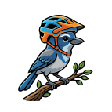

# jaycast

Forecast the best days for riding Camp Murphy's sandy MTB trails at Jonathan Dickinson State Park, FL.

**Live:** [https://upload.bike/jaycast/](https://upload.bike/jaycast/)

Browser-only (Rust → WASM via Leptos). Weather from [Open-Meteo](https://open-meteo.com/) with a **GFS seamless** / **ECMWF** model toggle. No API keys, no backend.

## Idea

Sandy, lightly shaded trails firm up after rain, then dry quickly under sun. Ideal ride window:

1. Meaningful rain in the prior ~1–3 days
2. Dry morning for the ride (afternoon storms are fine; the sand drains fast)
3. Comfortable temperature and a light breeze

Each day in a **30-day archive + 10-day forecast** gets a **1.0–5.0 star** score (one decimal) plus a factor breakdown. Day cards are tinted by score. Their subtle background curves show rain rising from the bottom and gray cloud cover descending from the top in three-hour periods, from midnight on the left through late evening on the right. Use **Older / Today / Newer** to scroll the timeline and check scores against days you rode. Units are **inches** and °F. Light/dark theme persists in the browser.

## Develop

```bash
# once
rustup target add wasm32-unknown-unknown
cargo install trunk   # or use a trunk binary release

trunk serve           # http://127.0.0.1:8080
cargo test            # heuristic unit tests
trunk build --release # static site in dist/
```

## Score model

Heuristic weights (see `src/score/params.rs` and `src/score/heuristic.rs`):

| Factor | Role |
|--------|------|
| Prior rain | Antecedent precip over ~72h; sweet spot ~0.35–3.0 in, ideal ~1.0 in |
| Pack timing | Best ~24h after a solid rain day; fades over ~5 dry days. ET0 (sun) speeds drying; cloud slows it |
| Rain during ride | Morning rain (before noon) is penalized; afternoon rain is mostly ignored |
| Temperature | Florida MTB comfort band, with heat-index ding |
| Wind | Ideal light breeze ~5–12 mph; dead calm and gales both ding |
| Forecast confidence | Tapers for farther days |

Top-level mix is roughly **pack 55% / weather 35% / confidence 10%**, with a hard gate on heavy morning rain. Tune constants in `params.rs` after real rides. This is not official trail status.

## License

GPL-3.0-or-later (see `LICENSE`).
