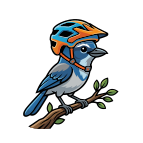

# jaycast

Weather-aware trail scores for South Florida mountain bike parks.

- **Live:** [https://upload.bike/jaycast/](https://upload.bike/jaycast/)
- **About / trail guides:** [https://upload.bike/jaycast/about/](https://upload.bike/jaycast/about/)
- **Screenshot**: [doc/jaycast.png](doc/jaycast.png)

Pick a park, check the stars, decide. No account or app install. Open it in the browser.

---

## Trails

| Park | Surface | After rain |
|------|---------|------------|
| **Camp Murphy** (Jonathan Dickinson) | Sandy scrub | Firms up after rain. Often better once packed |
| **Markham Park** (Weston) | Dirt / gravel | Can stay closed or sketchy until it drains |
| **Quiet Waters** (Deerfield Beach) | Mixed hardpack | Rarely a problem. Usually rideable again soon |

Park choice is remembered. Share a direct link with `?camp-murphy`, `?markham`, or `?quiet-waters`.

---

## What you see

- **Star score** (1.0-5.0) for each day: how rideable it looks, not official park status
- **Timeline**: yesterday through the next five days, color-tinted by score
- **Rain and clouds** on each day card (midnight to evening)
- **Cooler / warmer** cues on the card edges vs the prior week
- **Why**: tap a day for a factor breakdown (surface, rain window, temp, wind)
- **Weekend compare**: the grid icon stacks all three parks for the next several days and tags the **Best** pick. Tap a row to jump to that day

Units are inches and °F. Light or dark theme is saved.

Forecasts come from [Open-Meteo](https://open-meteo.com/). You can switch between GFS and ECMWF. Optional nearby rain gauges improve recent rainfall when available. This is not official trail status. Use judgment and local reports (for example, Markham's Facebook group when linked).

---

## Score model

Each trail is scored differently:

- **Camp Murphy**: sand pack after recent rain (penalizes a wet morning ride).
- **Markham**: estimates when dirt reopens after meaningful rain (advisory only).
- **Quiet Waters**: weights comfort weather more. Surface usually stays rideable.

See `src/score/` and [doc/TRAILS.md](doc/TRAILS.md). Code layout: [doc/CODEMAP.md](doc/CODEMAP.md).

---

## Develop

```bash
# once
rustup target add wasm32-unknown-unknown
cargo install trunk   # or a trunk binary release

trunk serve           # http://127.0.0.1:8080
cargo test
trunk build --release # static site in dist/
```

Native helpers (same scorer as the site):

```bash
# score a day or range
cargo run --features cli --bin jaycast -- analyze markham 2026-07-08:2026-07-11 both

# ground-truth gauge rain feed (needs XWEATHER_API_KEY; see doc/XWEATHER.md)
cargo run --features cli --bin jaycast -- xweather publish --out assets/rain.json
```

CLI details: [doc/CLI.md](doc/CLI.md).

---

## License

GPL-3.0-or-later. See `LICENSE`.

Contact: [upload.bike@gmail.com](mailto:upload.bike@gmail.com)
