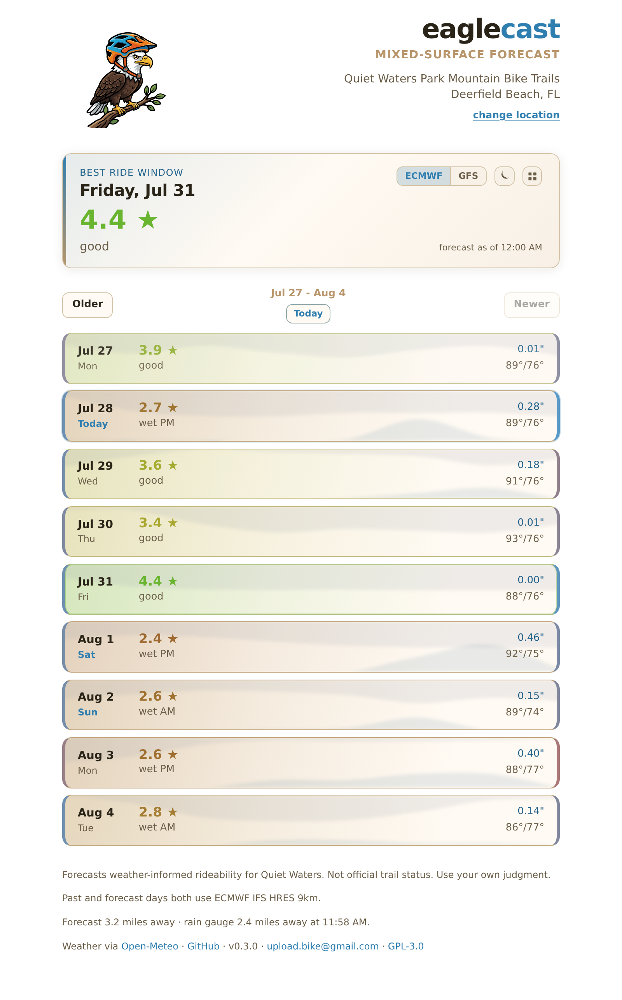

# Screenshot

Automated PNG screenshot with transparent (alpha) background via the `?screenshot` URL flag.

## Quick start

```bash
# take a screenshot of any trail
node screenshot.js quiet-waters jaycast.png
node screenshot.js markham markham.png
node screenshot.js camp-murphy camp-murphy.png
```

## How it works

1. Append `&screenshot` to any jaycast URL.
2. A small script in `<head>` strips the body background to `transparent` before paint.
3. The app auto-expands today's detail panel when `?screenshot` is present.
4. Puppeteer captures the page with `omitBackground: true`, producing an RGBA PNG.

```
https://upload.bike/jaycast/?quiet-waters&screenshot
```

## Example


